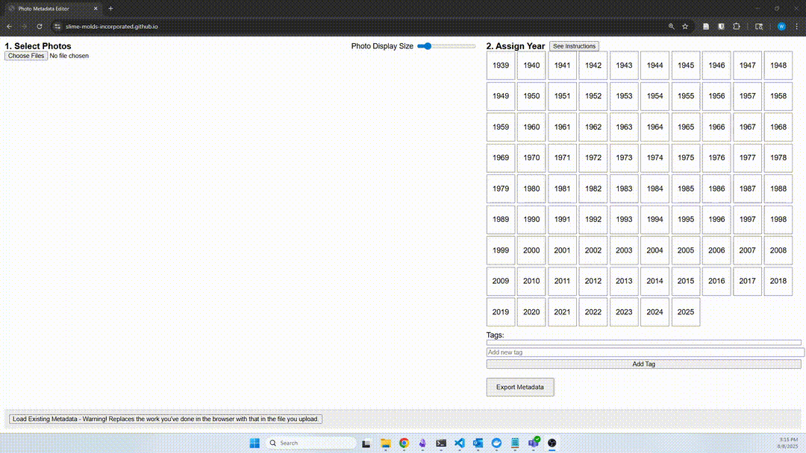
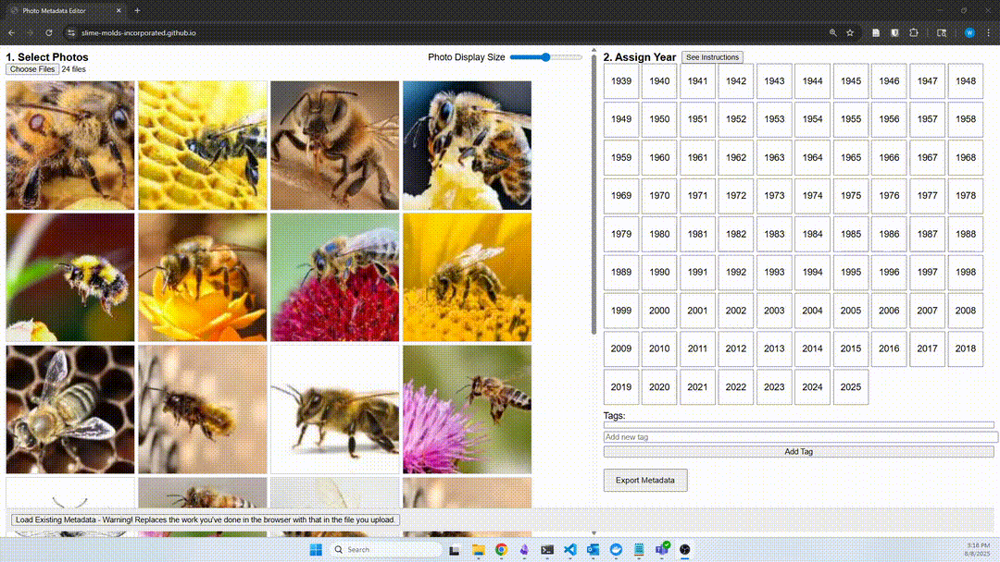
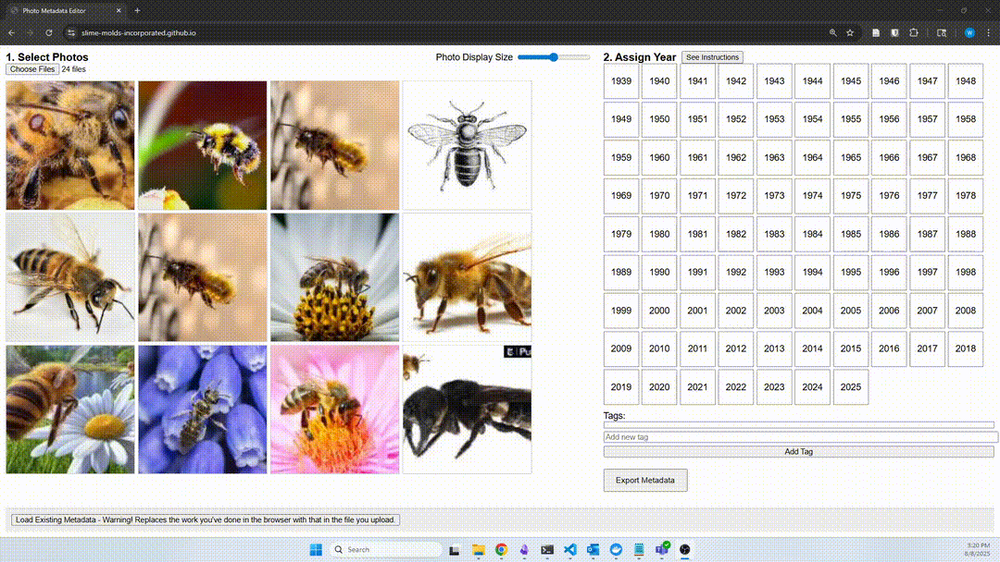
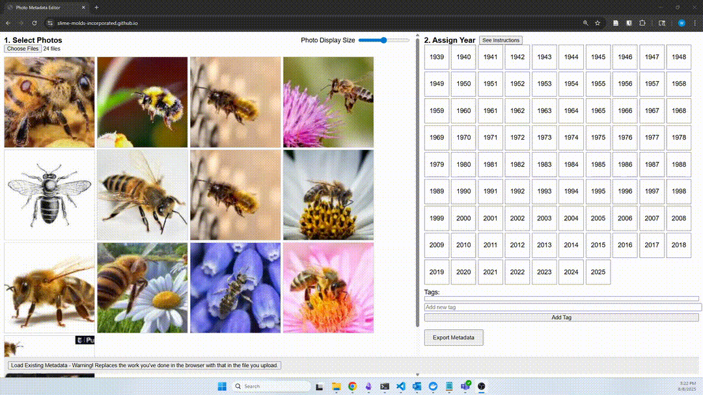

# Photo Date Editor

Label photos with their year and with arbitrary tags.  (The photos will never leave your machine.  The browser will operate on them locally.)

1) Choose a folder of .jpgs.  From here on, the left pane will display all the photos you haven't given a year.

2) Left click as many of the photos as you want.  Left click one again to unselect it.  Left click a year.  The photos are assigned the year, and disappear from the "unassigned pool" in the left panel.

3) To undo an assignment, right click a year to show all photos with the year.  In this mode, left clicking photos removes the year from them and moves them back to the unassigned pool.  Right click the year again to go back to the unassigned pool mode.

4) If you want to tag photos with arbitrary strings - "Bob", "Boat" - do so after selecting photos and before clicking a year.  (Undo for tags is not supported.  You could manually edit the exported metadata file if you must undo a tag.)

5) Export the metadata you've created to save your work.

6) To resume work in another session or after adding more photos to your master folder, upload the metadata file you created.

7) Finally, to apply the metadata to the images, hand the zip folder of all images and the metadata file to a programmer.  
